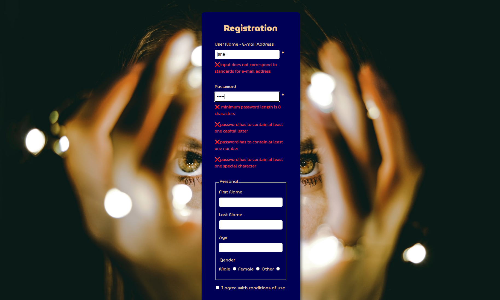
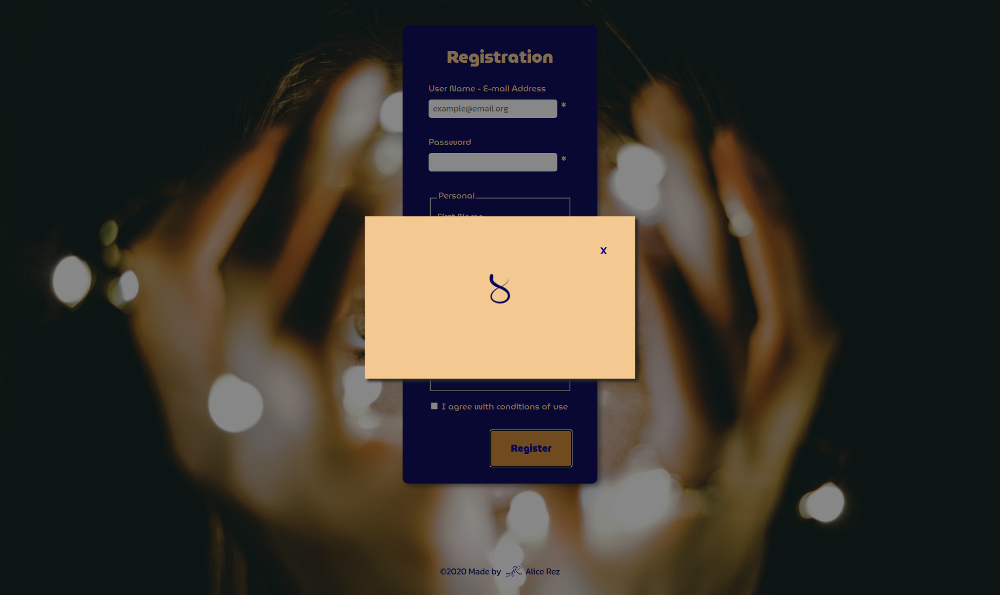
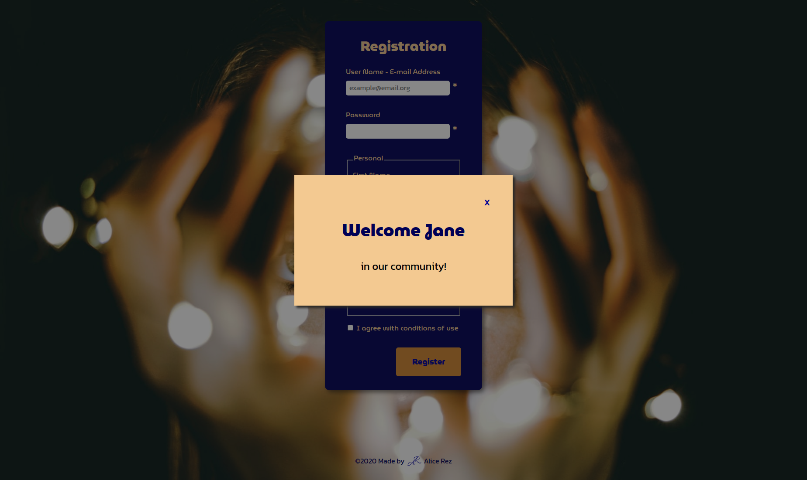

<h1> </h1>

## Description

[Live Demo](https://alice-rez.github.io/Front-end-registration-form-with-modal-and-validation/)

Small project done cca in half of my one-year course (after finishing with Vanilla JS in browser module, before starting Node.js and frameworks). Demo of the registration form with implemented validation of the e-mail address and password, pop-upped modal with loader (as simulation to waiting for the data to be successfully sent) replaced later by welcoming message (customized with the name of the user) and simulation of the data collecting. Without using server side. The form cannot be submitted without filling the required inputs and agreement with the conditions.

E-mail address have to contain @, at least one letter before it and after it, dot after it and another at least one letter after dot. Password has to be at least 8 character long with one capital, one number and one special character used.

The simulation of the data collecting is done by storing all inputs about user in one object (_submit_) and than adding this object in array of users (_users_).

## Implementation

**Used technologies**: Vanilla JS, DOM, RegExp, array destructuring, HTML, CSS, CSS variables

RegExp were used for validation of the e-mail and password (check if it corresponds the rules). Array destructuring was used for assignment of the different inputs to different variables (from array of all inputs).

Event for validation is input, so the user immediately see, if the e-mail/password are correct or not.

According to responsiveness, emphasis was placed at correct positioning of the background image, so the eyes are still approximately at the same place

## Gallery

**Fig.1** : Validation of the e-mail and password - display of error messages

 
 
 

**Fig.2** : Pop-up with loader (for the time of data processing)

 
 
 

**Fig.3** : Pop-up with customized Welcome message

